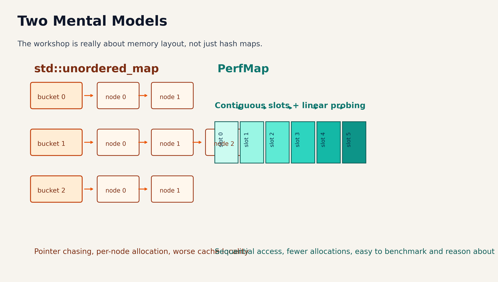
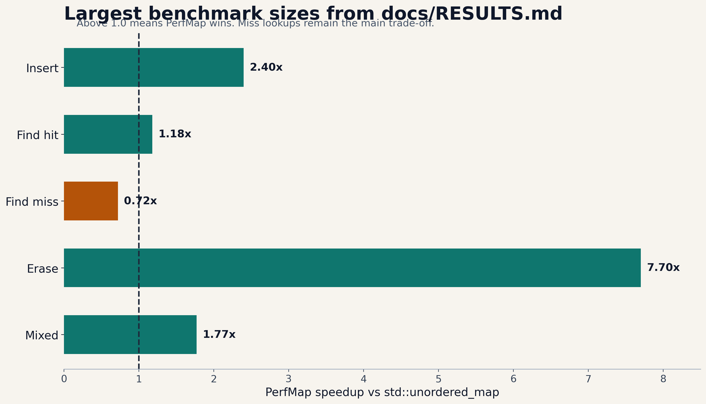

# One-Line Pitch

Build a cache-aware hash map that can beat `std::unordered_map` on real workloads.

- Google-style C++
- Google Benchmark + Google Test + Abseil
- Strong resume bullet with measurable results

::: notes
Open by framing the workshop as a systems project, not a toy data-structures lecture.
The pitch is that students leave with code, benchmarks, and a story they can defend in interviews.
Mention the date as March 10, 2026 and avoid reading out a specific time until the event logistics are finalized.
:::

# Why This Project Works In 2026

- Generic CRUD apps are cheap to generate.
- Benchmark numbers are much harder to fake.
- `perfmap` forces students to explain cache locality, memory layout, and trade-offs.
- It is Google-relevant, technically deep, and easy to extend after the workshop.

**Translation for resumes:** one repo can become systems, cloud, or ML infra depending on the direction you take it.

::: notes
This is where you can talk about recruiter fatigue and the Claude era without sounding cynical.
The key message is not "AI bad"; it is "measurable engineering work stands out."
:::

# Workshop Flow

1. Build and run the repo.
2. Understand the data structure and its design choices.
3. Run tests, benchmarks, and explain the wins and losses.
4. Show three serious ways to extend the project.
5. Hand off to mock interview and guest Q&A.

::: notes
Keep this slide brisk. It tells the audience there is a beginning, a measurable middle, and a concrete next step.
:::

# What Attendees Leave With

- A niche C++ project they can actually talk about
- A repo using `cmake`, Google Test, Google Benchmark, Abseil, and Google-style conventions
- A benchmark-backed resume bullet
- A roadmap for a post-workshop mini hackathon or personal extension

**Better than saying “I built a data structure”:** say what you measured, what trade-off you found, and what you improved next.

::: notes
This is a good place to tie outcomes back to co-op search, networking, and interview prep.
:::

# What PerfMap Actually Is

- Open-addressing hash map in C++17
- Flat `std::vector<Slot>` storage for better locality
- Linear probing plus tombstone-aware deletion
- Power-of-two capacity and bitmask indexing
- `absl::Status` / `absl::StatusOr` API plus `FindPtr()` zero-allocation fast path

**Core lesson:** modern performance work is often about memory behavior, not just asymptotic complexity.

::: notes
Do not get lost in every method signature yet.
What matters here is that the repo has enough substance to discuss architecture, correctness, and optimization.
:::

# Why It Can Beat The STL

{width=88%}

::: notes
Use this to contrast pointer chasing with contiguous storage.
Say explicitly that `std::unordered_map` is not "bad"; it has different trade-offs and better miss behavior in this benchmark.
:::

# Benchmarks: The Part Recruiters Remember

{width=86%}

- Insert: `2.0x` to `4.0x` faster
- Erase: `6.4x` to `8.0x` faster
- Mixed workload: `1.7x` to `3.5x` faster
- Miss lookups: still worse, which is the most interesting trade-off to discuss

::: notes
These numbers come directly from `project/perfmap/docs/RESULTS.md`.
Say that the miss path is not a flaw to hide; it is exactly the kind of trade-off that makes the project credible.
:::

# Google-Style C++ Angle

- Optimize for readability, maintainability, and team scale
- Prefer explicit error handling over cleverness
- Keep naming, formatting, and file structure boring and consistent
- Test correctness before chasing speed
- Benchmark only after the implementation is defensible

**The vibe:** not “fancy C++”, but “obvious C++ another engineer can debug at 2 a.m.”

::: notes
This is a direct bridge into your Google-style C++ explanation.
If you want, show one short snippet live instead of overloading the slide.
:::

# Live Demo Plan

```bash
cd project/perfmap/build
cmake .. -DCMAKE_BUILD_TYPE=Release
make -j8
./perfmap_tests
./perfmap_bench
```

- Walk through `slot.h`, `hash_map.h`, tests, and benchmarks
- Ask the room why tombstones exist before revealing the answer
- Show how a tiny API choice like `FindPtr()` changes performance

::: notes
The best teaching moment is the tombstone invariant and the `FindPtr()` fast-path lesson.
That gives students both a data-structure concept and a performance-engineering concept.
:::

# Extension Track 1: AWS / DevOps

- Containerize the benchmark runner for reproducible builds
- Run scheduled benchmarks on GitHub Actions plus EC2 or Graviton instances
- Store JSON benchmark history in S3 and surface regressions on a dashboard
- Add perf regression gates so slowdowns fail CI
- Wrap `perfmap` in a tiny key-value service and load-test it

**Resume angle:** “Built a performance regression pipeline and benchmark service, not just a local data structure.”

::: notes
If you want cloud credits or merch as prizes, this slide gives the cleanest justification: students can extend into real cloud infra after the workshop.
:::

# Extension Track 2: Low-Level AI / ML Systems

- Use `perfmap` as a hot-key cache for feature serving or inference metadata
- Simulate AI-serving access patterns: repeated hot keys, bursty misses, skewed distributions
- Compare scalar probing against SIMD-friendly probing on those workloads
- Track p50, p95, and p99 latency rather than just average throughput
- Turn it into a tiny “ML systems” repo without needing to train a giant model

**Pitch:** a lot of ML infra is memory systems, lookup paths, and latency budgets.

::: notes
This angle is stronger than “I used AI somehow.”
It connects the project to recommendation systems, retrieval, and inference serving without leaving systems territory.
:::

# Extension Track 3: Advanced Performance C++

- Robin Hood hashing to reduce probe-length variance
- SwissTable-style metadata bytes for faster filtering
- SIMD or NEON probing for multiple control bytes at once
- Custom allocators and prefetch experiments
- Sharded or concurrent variants with lock striping

**Interview angle:** now the project becomes a platform for discussing CPU caches, branch prediction, and memory layout decisions.

::: notes
This is the path for the strongest low-level students.
You can point out that even if they only implement one of these well, the project becomes much more unique.
:::

# Serious Mini Hackathon Prompt

**Challenge:** make `perfmap` more impressive without making it fake.

- Improve a metric
- Add tooling or observability
- Adapt it to a real workload
- Write a README that explains the design trade-offs

**Judging criteria:** measurable improvement, explanation quality, code quality, and realism.

::: notes
This slide is where you can mention merch, stickers, cloud credits, or repost incentives if those get confirmed.
Keep the criteria measurable so the extensions do not turn into vague feature dumping.
:::

# Questions For The Guests

- What makes a student project feel real instead of inflated?
- How much does performance work matter on real teams?
- What is the best way to talk about benchmarks in interviews?
- Which extension track would they personally pick next?

**Closing line:** the point is not to build a hash map forever; the point is to learn how to make technical work measurable and explainable.

::: notes
This is your handoff slide into the panel or Q&A section.
End by reinforcing that measurable, explainable engineering is the meta-skill.
:::
