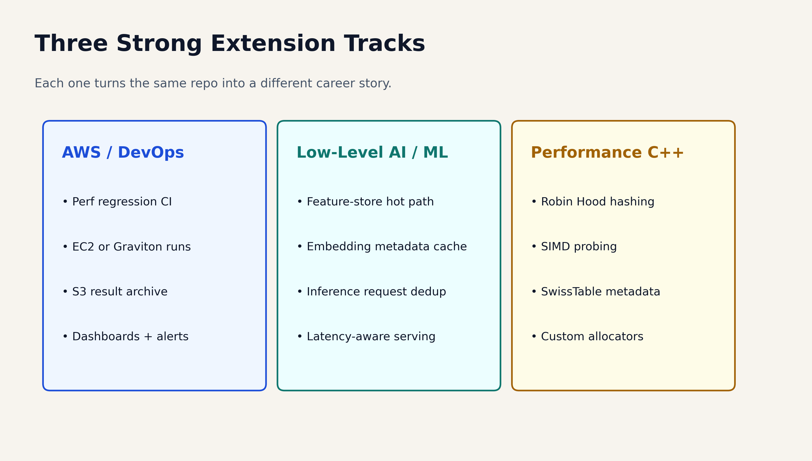

# One-Line Pitch

Build a custom hash map, measure it honestly, and leave with a project you can actually defend.

- Real workload story
- Real benchmark numbers
- Real trade-offs, not fake perfection

::: notes
Open hard and fast.
Tell them this is not a toy "we coded a hashmap from scratch" talk.
The point is to show how a small systems project becomes resume-grade when it has measurement, iteration, and a believable use case.
:::

# Quick Room Check

- Who here has coded in `C++`?
- Who has used a hash map without knowing how it works underneath?
- What makes a project feel impressive in 2026?
- What makes a project feel tutorial-tier?

::: notes
This is your first candy slide.
Ask for hands, then cold-call one or two short answers.
If someone says "real users," "benchmarks," "trade-offs," or "depth," reward that immediately because it sets up the rest of the talk.
:::

# What Makes A Project Stand Out In 2026

- It solves a real problem or models a believable workload
- It shows iteration, not just one lucky final result
- It has measurable evidence
- It uses AI intentionally, not invisibly
- It is specific enough that you can explain the hard parts

::: notes
This slide comes straight from your raw `IDEAS.md`.
Frame the modern bar clearly: the differentiator is not "I shipped code."
The differentiator is "I can explain why this design exists, what I tried, what failed, and what the numbers say."
:::

# What Makes A Project Feel Tutorial-Tier

- Generic CRUD with no real constraints
- No metrics, no benchmarks, no users, no feedback loop
- No honest loss or trade-off anywhere
- AI did the whole thing and you cannot explain the decisions
- Surface area everywhere, depth nowhere

::: notes
Do not sound bitter here.
The point is not to shame simple projects.
The point is to explain why reviewers default to skepticism when they see familiar project shapes with no evidence behind them.
:::

# Where Good Project Ideas Usually Come From

- coursework where you go beyond the assignment
- labs, research groups, startups, and hackathons
- repeated pain points you actually felt yourself
- niches with real constraints: latency, memory, scale, correctness
- follow-on iterations after a first version already works

::: notes
This is where you can briefly tell the "find real opportunities" story.
Keep it practical: clubs, professors, labs, startup work, hackathons, and personal pain are all credible project sources because they come with constraints.
:::

# Why PerfMap Is A Good Workshop Project

- small enough to understand in one session
- deep enough to talk about caches, memory layout, and trade-offs
- benchmarkable with one command
- easy to extend toward cloud, ML infra, or advanced C++
- strong because it includes both wins and losses

::: notes
Say explicitly that the project works because it is narrow.
It is one data structure, but it opens the door to systems thinking, benchmark rigor, and resume storytelling.
:::

# What PerfMap Actually Is

- open-addressing hash map in `C++17`
- flat `std::vector<Slot>` storage
- linear probing and tombstone-aware deletion
- power-of-two capacity and bitmask indexing
- `absl::Status` / `absl::StatusOr` plus `FindPtr()` for hot paths

::: notes
Do not drown them in syntax yet.
The important message is that memory layout is the main character, not the data structure name.
:::

# Why Flat Storage Can Win

{width=86%}

- fewer pointer jumps
- more contiguous memory access
- easier hardware prefetch behavior
- cleaner benchmark story

::: notes
Ask: "Why might the flat array beat a chained map even if both are O(1) on paper?"
Wait for someone to say cache locality or pointer chasing.
This is another candy moment.
:::

# One Repo, Multiple Workloads

- `HashMap`: balanced baseline
- `ReadHeavyHashMap`: lower load factor for faster lookups
- `ChurnHeavyHashMap`: more aggressive tombstone cleanup
- `SpaceEfficientHashMap`: tighter memory budget
- `IndirectHashMap`: better for large payloads
- `Scratch*` variants: built for repeated clear-and-rebuild cycles

::: notes
This slide helps you avoid the "one benchmark wonder" criticism.
The repo is not just one container; it is a small lab for workload-aware design.
:::

# The Benchmark Rules

- same deterministic key sets for every implementation
- same adapter contract for STL, Abseil, and PerfMap
- setup excluded from steady-state lookup and erase timing
- reserved benchmarks pre-size every container fairly
- separate "where we lose" benchmarks kept in the repo on purpose

::: notes
Ask the room what would make a performance claim feel fake.
Then show that fairness rules are part of the engineering, not presentation polish.
This is where you define regression tracking, benchmark harnessing, and honest methodology in simple language.
:::

# The Honest Result

- `perfmap::ScratchIndirectHashMap` is the strongest real win
- at `16,384` entries it runs around `53.0M items/s`
- that is about `7.3x` faster than `std::unordered_map`
- `absl::flat_hash_map` still wins broad large-value lookup
- the honest loss is part of why the repo is credible

::: notes
Use exact numbers from the March 31, 2026 spot check.
Say them slowly.
Then immediately say the broader large-value case still loses badly to Abseil on misses and still loses on hits too.
That honesty is what makes the win worth listening to.
:::

# The Winning Workload Story

- think: per-batch document enrichment cache
- each batch contains many records and large metadata blobs
- build a temporary lookup structure for that batch
- query it hard during the batch
- clear it and rebuild for the next batch

::: notes
This is the real-world scenario you were asking for in `IDEAS.md`.
High level: "temporary cache for one batch."
Technical level: "large values plus repeated rebuilds, so O(1) clear and indirect storage matter."
That makes the niche understandable without sounding fake.
:::

# Why Google-Style C++ Matters Here

- explicit error handling
- boring naming and formatting
- correctness before optimization
- benchmark after the code is defensible
- code another engineer can read at `2 a.m.`

::: notes
Make the two-space-indent joke once and move on.
The real point is team-readable C++, not style cosplay.
Tie `StatusOr`, tests, and file organization back to "production-minded code."
:::

# Live Demo Plan

```bash
cd project/perfmap/build
cmake .. -DCMAKE_BUILD_TYPE=Release
make -j8
./perfmap_tests
./perfmap_bench
```

- show `slot.h`, `hash_map.h`, tests, and benchmark harness
- ask why tombstones exist before revealing the answer
- ask why `FindPtr()` exists before showing the miss-path cost

::: notes
This is where you slow down and teach.
The two best demo moments are:
1. a tombstone preserving the probe chain
2. a tiny API decision changing benchmark behavior
:::

# What Students Can Build Next

{width=92%}

::: notes
This slide lets you branch by audience interest.
If the room is cloud-heavy, talk CI and Graviton.
If the room is ML-heavy, talk feature-serving metadata caches.
If the room is systems-heavy, talk Robin Hood hashing and metadata bytes.
:::

# Starter Repo For Attendees

- clone the incomplete starter from `starter/perfmap-10d`
- fill in the core open-addressing behavior
- make the tombstone test pass
- make rehashing work
- then benchmark your version against the completed repo

::: notes
Tell them you are giving them the "workshop version," not the full polished repo.
That starter is intentionally incomplete so they get to build the important ideas themselves.
:::

# Mini Challenge

- improve one metric without lying about the result
- explain one design choice clearly
- document one honest loss
- add one extension only if it makes the repo more measurable or more useful

::: notes
This is a strong place to mention follow-up prizes, shout-outs, GitHub stars, or post-workshop submissions if you want.
Keep the judging criteria concrete so nobody mistakes "more features" for "better engineering."
:::

# Questions For The Room And The Guests

- What do you think matters more: novelty, depth, or measurable impact?
- If you had one more week, which extension would you ship first?
- What makes a benchmark claim believable in an interview?
- What turns a student repo into something recruiters actually remember?

::: notes
End by bringing the audience back into the conversation.
The closing line should be some version of:
"The point is not to build a hash map forever. The point is to learn how to do technical work that is measurable, explainable, and hard to fake."
:::
